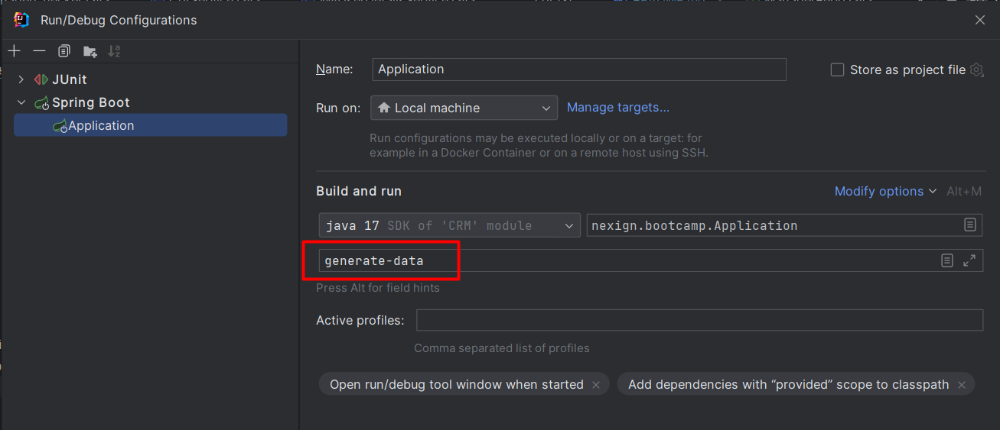
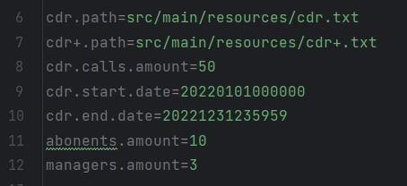

<!-- PROJECT LOGO -->
 

  

  <h3 align="center">NexignBootcampHW</h3>
   

    Описание проекта на момент 23.04.2023

<!-- TABLE OF CONTENTS -->

  
Содержание

  <ol>
    <li>
      <a href="#about-the-project">О проекте</a>
    </li>
    <li><a href="#roadmap">Roadmap</a></li>
    <li><a href="#contributing">Вклад участников</a></li>
    <li><a href="#contact">Контакты</a>
    </li>
  </ol>

<!-- ABOUT THE PROJECT -->
## Общее описание проекта

Система осуществляет тарификацию абонентов телефонного оператора путем взаимодействия нескольких модулей:
* CRM
* CDR (Call Data Record)
* BRT (Billing Real Time)
* HRS (High performance rating server) 

### Архитектура

* Монолит, в котором границы каждой подсистемы определяются одноименными Java-пакетами.
Благодаря такому решению довольно просто решился вопрос с первичной тарификацией. Кроме того, как бы там ни было,
но все подсистемы обращаются к одной и той же базе данных, причем минимум две - на запись.
Поэтому, чтобы правильно организовать работу микросервисов пришлось бы обеспечивать распределенную транзакционность.

* Схема БД

* При проектировании БД отталкивался от того факта, что любой тариф можно отнести к одной из двух групп:
либо стоимость одной конкретно взятой минуты разговора зависит то того, сколько минут абонент проговорил до этого, либо нет. 
Например, тариф "Безлимит" относится к первой группе, поскольку каждая минута разговора из первых 300-сот сама по себе не стоит 
абоненту ничего(хотя он и платит фиксированную сумму), однако начиная с 301-ой минуты стоимость как входящих, так и исходящих звонков
меняется. То же самое относится и к тарифу "Обычный" с его 100 минутами исходящих по льготной цене. А вот у "Поминутного" цена минуты
разговора константна - он относится к категории второй.
Такая схема позволяет единообразно протарифицировать абонентов с любым тарифом с первым "уровнем вложенности" цены минуты разговора.
Если введут тариф у которого цена минуты разговора в пределах [0, n] минут стоит x рублей, [n+1; m] - y, а [m+1, l] - z, то все, к сожалению, сломается.

### Технологии

* Spring Framework
* Hibernate
* Postgres

### Использование

#### Пререквезиты:
* Установленная на локальной машине СУБД PostgreSQL v.14+ с базой данных ``nexign-bootcamp``, 
в которой создана роль с паролем, идентичная данным в файле ``application.properties``.
* Java 17
#### Запуск:
* Во время первичного запуска приложения, процесс тарификации начинается автоматически.
Поэтому перед этим необходимо сгенерировать данные (абоненты и их тарифы, менеджеры). Для этого достаточно 
прописать ``generate-data`` в параметрах запуска SpringBoot-приложения:

* Перед этим в файле ``application.properties`` можно по своему усмотрению задать некоторые параметры генерации. Например, 
количество генерируемых абонентов и менеджеров, или временной интервал в рамках которого будут лежать все генерируемые CDR звонки 

* Сецификация публичных API автогенерируемая, и доступна по адрессу http://localhost:8090/swagger-ui/index.html.

<!-- ROADMAP -->
## Roadmap

для разработчика:
- [x] Спроектировать схему БД и обеспечить автогенерацию данных
- [x] Написать бизнес-логику для API предоставляемого CRM
- [x] Реализовать авторизацию по ролям в сервисе CRM
- [x] Организовать взаимодействие подсистем CDR, BRT, HRS согласно основным требованиям
- [x] Дополнить Swagger-документацию
- [ ] Спроектировать схему БД так, чтобы было возможно добавление тарифа X
    P.S. В данную схему будет легко вписать этот тариф, если почти каждый атрибут продублировать
    двойником для не абонентов "Ромашки". Концептуально это ничего не поменяет,
    но заниматься дублированием как атрибутов таблиц, так и кода бизнес-логики не хочется.
- [ ] Организовать кэш в подсистемах CDR и BRT

для тестировщика:
- [x] Составить тестовую документацию  
    Выявлены классы эквивалентности для тарификации звонка относительно его длительности
- [x] Разработать генератор CDR файлов  
    Создает текстовый файл на выходе со звонками в выбранном диапозоне времени
- [x] Составить тесты для CDR  
    Относительно классов эквивалентности составил тесты для тестирования граничных значений 
- [ ] Составить автотесты для API  
    Создать тесты опираясь на документацию Swagger
- [ ] Составить интеграционные автотесты  

(<a href="#readme-top">к началу</a>)

<!-- CONTACT -->
## Contact

Контакты разработчика:
* https://t.me/Wa4owski

Контакты тестировщика:
* https://t.me/Crystalion

(<a href="#readme-top">к началу</a>)

