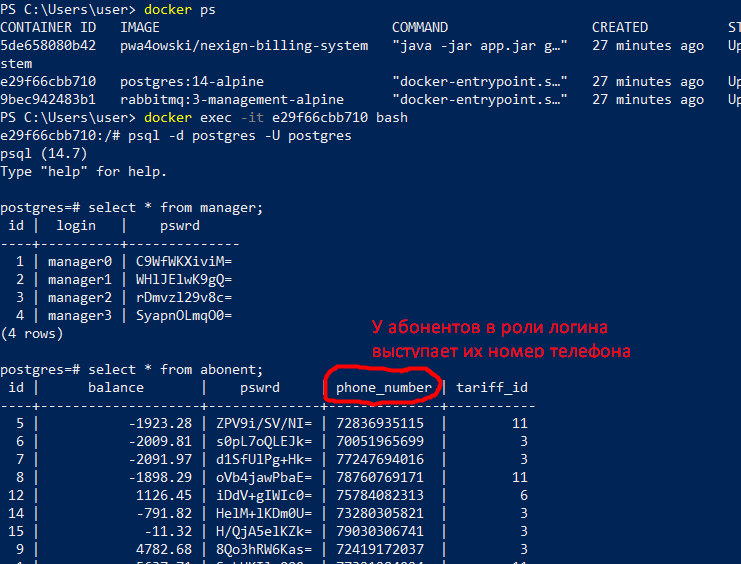

<a name="readme-top"></a>
<!-- PROJECT LOGO -->
<br />
<div align="center">
  <a href="https://github.com/pwa4owski/NexignBootcampHW/tree/CDR">
    
  </a>

  <h3 align="center">NexignBootcampHW</h3>
   <p align="center">
    Описание проекта на момент 01.05.2023</p>
</div>


<!-- TABLE OF CONTENTS -->
<details>
  <summary>Содержание</summary>
  <ol>
    <li>
      <a href="#about-the-project">О проекте</a>
    </li>
    <li><a href="#roadmap">Roadmap</a></li>
    <li><a href="#contact">Контакты</a>
    </li>
  </ol>
</details>


<!-- ABOUT THE PROJECT -->
## Общее описание проекта

Система осуществляет тарификацию абонентов телефонного оператора путем взаимодействия нескольких модулей:
* **CRM (Customer Relationship Management)** - предоставляет API для пользователей. 
* **CDR (Call Data Record)** - по запросу генерирует CDR-файл
* **BRT (Billing Real Time)** - обрабатывает CDR-файл, отфильтровывает записи о звонках существующих абонентов, и записывает их в CDR+-файл. Вызывает HRS, и обновляет данные в хранилище в соответствии с результатами его работы.
* **HRS (High performance rating server)**  - обрабатывает CDR+, обсчитывает данные по каждому звонку абонента, их общую стоимость и возвращает BRT.

### Архитектура

* Монолит, в котором границы каждой подсистемы определяются одноименными Java-пакетами.
Благодаря такому решению довольно просто решился вопрос с первичной тарификацией. Кроме того, как бы там ни было,
но все подсистемы обращаются к одной и той же базе данных, причем минимум две - на запись.
Поэтому, чтобы правильно организовать работу микросервисов пришлось бы обеспечивать распределенную транзакционность.
####
* Схема БД


* При проектировании БД отталкивался от того факта, что любой тариф можно отнести к одной из двух групп:
либо стоимость одной конкретно взятой минуты разговора зависит то того, сколько минут абонент проговорил до этого, либо нет. 
Например, тариф "Безлимит" относится к первой группе, поскольку каждая минута разговора из первых 300-сот сама по себе не стоит 
абоненту ничего(хотя он и платит фиксированную сумму), однако начиная с 301-ой минуты стоимость как входящих, так и исходящих звонков
меняется. То же самое относится и к тарифу "Обычный" с его 100 минутами исходящих по льготной цене. А вот у "Поминутного" цена минуты
разговора константна - он относится к категории второй.
Такая схема позволяет единообразно протарифицировать абонентов с любым тарифом с первым "уровнем вложенности" цены минуты разговора.
Если же их два и более, то есть, цена минуты разговора в пределах ``[0, n]`` минут стоит ``x`` рублей, ``[n+1; m]`` - ``y``, а ``[m+1, l]`` - ``z`` и т.д., то 
то схему придется перестраивать, но, надеюсь, маркетологи до такого не додумаются :)
####
* Первичная генерация данных 
Реализована средствами Spring. При запуске приложения с параметром ``generate-data``, 
из контекста берется [компонент](https://github.com/pwa4owski/NexignBootcampHW/blob/master/src/main/java/nexign/bootcamp/util/DataGenerationService.java), 
у которого вызывается соответсвующий метод. Таким же образом осуществляется первичная тарификация.
<p align="right">(<a href="#readme-top">к началу</a>)</p>

### Технологии

* 
* 
* 
* 
* 
* 

### Использование

* Обратите внимание на параметры сервиса ``billing-system`` в [docker-compose.yml](https://github.com/pwa4owski/NexignBootcampHW/blob/master/docker-compose.yml)
     ```` #параметры генерации данных
      CDR_CALLS_AMOUNT: "60"
      CDR_START_DATE: "20220101000000"
      CDR_END_DATE: "20221231235959"
      ABONENTS_AMOUNT: "18"
      MANAGERS_AMOUNT: "4" 
  
*  Перед запуском ``docker-compose up`` вы можете задать их по своему усмотрению 
* ВАЖНО! В начале могут сыпаться исключения о том, что основной сервис не может подключиться к `rabbitmq`, однако к окончательному
развертыванию контейнеров, они друг друга находят, главное дождаться :)
* После запуска всех контейнеров, посмотреть на результаты генерации и обработки файлов вы можете 
 через оболочку ``bash`` контейнера ``billing-system``. Оба файла будут находиться в директории `src/main/resources` 
* Взять данные для авторизации пользователей можно из базы данных:
 
* Пароли хранятся без шифрования, их можно вставлять в форму авторизации в том же виде.

* Спецификация публичных API автогенерируемая, и доступна по адресу http://localhost:8090/swagger-ui/index.html.

<p align="right">(<a href="#readme-top">к началу</a>)</p>

<!-- ROADMAP -->
## Roadmap

### для разработчика:
- [x] Спроектировать схему БД и обеспечить автогенерацию данных
- [x] Написать бизнес-логику для API предоставляемого CRM
- [x] Реализовать авторизацию по ролям в сервисе CRM
- [x] Организовать взаимодействие подсистем CDR, BRT, HRS согласно основным требованиям
- [x] Дополнить Swagger-документацию
- [ ] Спроектировать схему БД так, чтобы было возможно добавление тарифа X
    ##### P.S. В данную схему будет легко вписать этот тариф, если почти каждый атрибут продублировать двойником для не абонентов "Ромашки". Концептуально это ничего не поменяет, но заниматься дублированием как атрибутов таблиц, так и кода бизнес-логики не хочется.
- [x] Организовать кэш в подсистемах CDR и BRT
  ##### P.S. Кэш организован только в CDR, поскольку там нам нужно лишь актуальное количество абонентов и их номера телефонов, так что быстрое Read-Only хранилище очень помогает. А вот в BRT нам в любом случае нужно перезаписывать баланс абонентов, так что придется  лезть в базу в любом случае, и кэш нецелесообразен.

### для тестировщика:
- [x] Составить тестовую документацию <br/>
    Выявлены классы эквивалентности для тарификации звонка относительно его длительности
- [x] Разработать генератор CDR файлов <br/>
    Создает текстовый файл на выходе со звонками в выбранном диапозоне времени
- [x] Составить тесты для CDR <br/>
    Относительно классов эквивалентности составил тесты для тестирования граничных значений 
- [ ] Составить автотесты для API <br/>
    Созданы базовые тесты для проверки работы запросов при позитивном сценарии.
    Планируется доработка тестов и расширение покрытия
- [ ] Дополнить автотесты другими тестами (например UI) <br/>


<p align="right">(<a href="#readme-top">к началу</a>)</p>


<!-- CONTACT -->
## Contact

Контакты разработчика:
* https://t.me/Wa4owski

Контакты тестировщика:
* https://t.me/Crystalion

<p align="right">(<a href="#readme-top">к началу</a>)</p>


