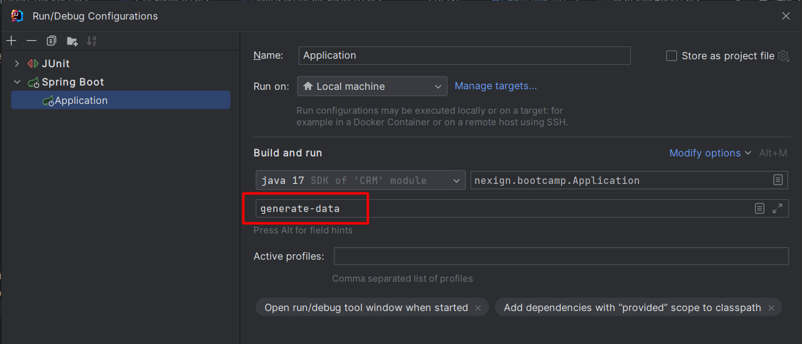
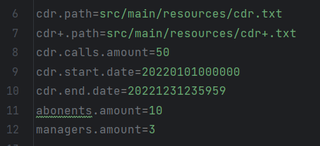

### Использование

#### Пререквезиты:
* Установленная на локальной машине СУБД PostgreSQL v.14+ с базой данных ``nexign-bootcamp``,
  в которой создана роль с паролем, идентичная данным в файле ``application.properties``.
* Java 17
* RabbitMQ
#### Запуск:
* Во время первичного запуска приложения, процесс тарификации начинается автоматически.
  Поэтому перед этим необходимо сгенерировать данные (абоненты и их тарифы, менеджеры). Для этого достаточно
  прописать ``generate-data`` в параметрах запуска SpringBoot-приложения:

* Перед этим в файле ``application.properties`` можно по своему усмотрению задать некоторые параметры генерации. Например,
  количество генерируемых абонентов и менеджеров, или временной интервал в рамках которого будут лежать все генерируемые CDR звонки

* Спецификация публичных API автогенерируемая, и доступна по адресу http://localhost:8090/swagger-ui/index.html.
